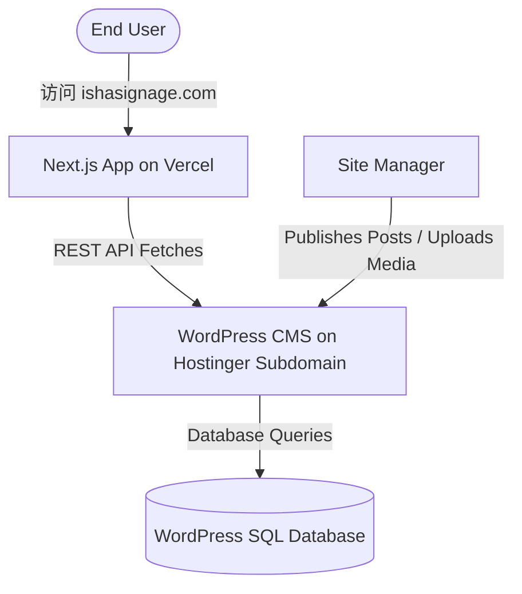

# Headless WordPress & Domain Migration Manual

This guide outlines the precise steps to transition your primary domain (`ishasignage.com` / `ishasiganges.com`) from Hostinger WordPress directly to your premium Next.js site hosted on Vercel, while shifting the existing WordPress backend into a dedicated **Hostinger Subdomain** (`wp.ishasignage.com`) to serve as your API database.

---

## Architecture Overview



---

## Phase 1: Shift WordPress to Subdomain on Hostinger

To keep your existing blog posts, pages, and media libraries intact, we will shift the existing Hostinger WordPress site to a subdomain (e.g., `wp.ishasignage.com`).

### Step 1.1: Create Subdomain on Hostinger hPanel
1. Log in to your **Hostinger hPanel**.
2. Navigate to **Websites** -> click **Manage** on your domain.
3. In the sidebar, search for **Subdomains**.
4. Create your new subdomain:
   * **Subdomain**: `wp` (resulting in `wp.ishasignage.com`)
   * **Custom folder for subdomain**: Select this checkbox if you wish to keep files clean and isolated (recommended), or point it to the default directory. Click **Create**.

### Step 1.2: Update WordPress Site URLs
Before moving the files, you must let WordPress know its new home URL:
1. Log into your current WordPress dashboard at `https://ishasignage.com/wp-admin`.
2. Go to **Settings** -> **General**.
3. Update the following fields:
   * **WordPress Address (URL)**: `https://wp.ishasignage.com`
   * **Site Address (URL)**: `https://wp.ishasignage.com`
4. Scroll down and click **Save Changes**.
   > [!NOTE]
   > Your browser will instantly log you out or show a "Site Not Found" error. This is normal and expected because the domain hasn't been routed to the subdomain files yet!

### Step 1.3: Move WordPress files to Subdomain Folder
If you didn't check "custom folder" in Step 1.1:
1. Go to **Files** -> **File Manager** on Hostinger.
2. Enter the `public_html` directory of your main website.
3. Move all contents (everything inside `public_html`) into the newly created subdomain directory: `public_html/wp` (or whichever folder Hostinger assigned to your subdomain).
4. Verify that `wp-config.php` and your uploads directories have moved successfully.

---

## Phase 2: Deploy Next.js App to Vercel

Now, we configure the frontend on Vercel to fetch all blog details and media dynamically from the Hostinger subdomain.

### Step 2.1: Import Project to Vercel
1. Log in to [Vercel](https://vercel.com).
2. Click **Add New** -> **Project**.
3. Import your GitHub repository (`isha-3d-landing`).

### Step 2.2: Configure Production Environment Variables
In the Vercel Project dashboard, go to **Settings** -> **Environment Variables**, and set:

| Variable Name | Value | Description |
| :--- | :--- | :--- |
| `NEXT_PUBLIC_WORDPRESS_URL` | `https://wp.ishasignage.com` | The new Hostinger subdomain API link. |
| `NEXT_PUBLIC_SITE_URL` | `https://ishasignage.com` | Your primary custom domain. |
| `RESEND_API_KEY` | `re_...` | Your Resend API key for contact forms. |

### Step 2.3: Build & Deploy
Click **Deploy**. Vercel will build the production bundle of your Next.js application.

---

## Phase 3: Route Primary Domain to Vercel

With the WordPress API active on the subdomain and Vercel serving your Next.js app, we can now direct the primary domain to Vercel.

### Step 3.1: Add Domain on Vercel Settings
1. On Vercel, go to **Project Settings** -> **Domains**.
2. Add your custom domain: `ishasignage.com` (Vercel will automatically suggest adding `www.ishasignage.com` as a redirect, click Add).

### Step 3.2: Update DNS Records on Hostinger hPanel
To route visitors from the main domain to Vercel, configure these DNS records in Hostinger:
1. On Hostinger, go to **Domains** -> click **Manage** next to your domain.
2. Select **DNS / Nameservers** in the sidebar (DNS Zone Editor).
3. Update/Add the following records:

#### 1. Point the Naked Domain (`@`) to Vercel:
* **Type**: `A`
* **Name**: `@`
* **Points to**: `76.76.21.21` (Vercel's Global IP)
* **TTL**: `14400` (or default)

#### 2. Point the WWW Domain to Vercel:
* **Type**: `CNAME`
* **Name**: `www`
* **Points to**: `cname.vercel-dns.com`
* **TTL**: `14400` (or default)

> [!WARNING]
> Ensure you remove any old **A Records** pointing the naked domain `@` to Hostinger's standard IP so they do not conflict with Vercel's IP!

---

## Phase 4: Handle Media Paths & Optimization

Since WordPress is headless, all uploaded images (e.g., `wp-content/uploads/2026/05/logo.jpg`) are hosted on the subdomain: `https://wp.ishasignage.com`.

### Step 4.1: Next.js Remote Image Whitelisting
To allow Next.js to dynamically fetch, render, and optimize remote images from your WordPress subdomain, we have already added wildcard image matching inside [next.config.ts](file:///mnt/warehouse/Armory/Projects/isha-3d-landing/next.config.ts):

```typescript
import type { NextConfig } from "next";

const nextConfig: NextConfig = {
  reactCompiler: true,
  images: {
    remotePatterns: [
      {
        protocol: "http",
        hostname: "**",
      },
      {
        protocol: "https",
        hostname: "**",
      },
    ],
  },
};

export default nextConfig;
```

---

## Verification & Launch Checklist

* [ ] **Subdomain Health Check:** Navigate to `https://wp.ishasignage.com/wp-admin` to confirm you can log in, edit posts, and view the media library.
* [ ] **REST API Active:** Go to `https://wp.ishasignage.com/wp-json/wp/v2/posts` in your browser. Verify you see the JSON list of posts.
* [ ] **Next.js Vercel Production Build:** Ensure Vercel states "Ready" with a green checkmark.
* [ ] **DNS Propagation:** Wait 5-15 minutes for Hostinger DNS records to propagate. Use [DNSChecker.org](https://dnschecker.org) to check if your naked domain points to `76.76.21.21`.
* [ ] **Dynamic Sitemap Verification:** Open `https://ishasignage.com/sitemap.xml` to ensure your Next.js frontend is dynamically reading the new WordPress subdomain posts!
